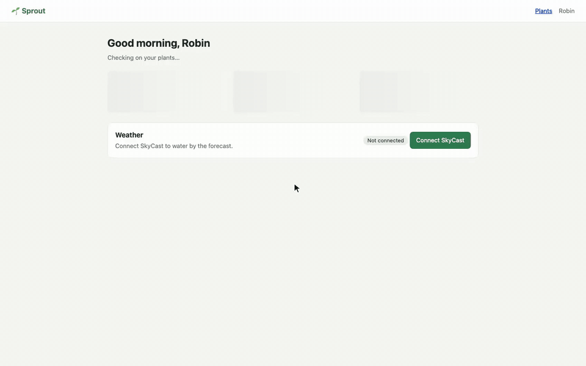

# lest

Run end-to-end flows against real systems, lest the path your users depend on
breaks unnoticed.

A flow is a YAML file of steps: scripts, HTTP requests, assertions, and calls
to other flows. Lest runs it against the environment you choose, checks the
tools it needs first, keeps every result in a report, and cleans up after
itself, even when you cancel.

```yaml
apiVersion: lest/v1
id: hello
name: Hello, Lest
vars:
  greeting: hello
steps:
  - id: say
    run: echo "$greeting from $LEST_FLOW_ID"
    outputs:
      text: self.stdout.trim()
  - id: check
    assert: steps.say.outputs.text == 'hello from hello'
```

```console
$ lest run hello
▶ Hello, Lest · run 20261007T123002Z-vhyf
  ✓ say                         10ms
  ✓ check                        0ms
passed hello 11ms 20261007T123002Z-vhyf
```

## Install

From source (Rust stable):

```bash
cargo install --git https://github.com/open-cli-collective/lest --locked lest
```

## Quick start

```bash
mkdir my-flows && cd my-flows
lest init            # creates lest.yaml and flows/hello.lest.yaml
lest run hello
lest list
lest runs list
```

## What a flow can do

- **Steps:** `run` a script, send an `http` request, `assert` conditions,
  drive a `browser`, call another `flow`, or group steps in order or in
  `parallel`.
- **Expressions:** one language, [CEL](https://github.com/google/cel-spec),
  for conditions, assertions and outputs, and `${{ expr }}` inside strings.
  Values reach scripts as environment variables, never as text spliced into
  shell code.
- **Retries and polling:** `retry: {attempts, delay, until}` on any step.
- **Services:** start a dev server or mock before the steps, wait until it
  is ready, and stop it after.
- **Environments and inputs:** named variable sets and per-run choices.
- **Secrets:** referenced by name, resolved from the OS keyring, environment
  variables or any password-manager command, and redacted from every output
  and report.
- **Tool preflight:** each CLI a flow needs is checked for presence, version
  and sign-in before anything runs.
- **Cleanup:** steps register commands that undo them; they run after the
  flow, on failure and on cancel, and can be replayed later with
  `lest cleanup <run>`.
- **Reports:** a JSON report per run (`lest schema report` describes it),
  JUnit XML, and `lest bundle` evidence zips with checksums.

An API flow from the examples signs in, adds a plant, polls until its sensor
pairs, and removes the plant again:

```yaml
  - id: add_plant
    http:
      method: POST
      url: "${{ vars.base_url }}/api/plants"
      headers: { Authorization: "Bearer ${{ steps.sign_in.outputs.token }}" }
      json: { name: Basil, room: Kitchen, moisture: 55 }
    expect: self.status == 201
    outputs: { id: self.body.id }
    cleanup:
      run: curl -fsS -X DELETE -H "Authorization: Bearer $TOKEN" "$base_url/api/plants/$ID"
      env:
        ID: "${{ self.outputs.id }}"
        TOKEN: "${{ steps.sign_in.outputs.token }}"

  - id: sensor_online
    http:
      url: "${{ vars.base_url }}/api/plants/${{ steps.add_plant.outputs.id }}/status"
      headers: { Authorization: "Bearer ${{ steps.sign_in.outputs.token }}" }
    outputs: { sensor: self.body.sensor }
    retry: { attempts: 6, delay: 300ms, until: self.outputs.sensor == 'online' }
```


## Failures that explain themselves

A failed step leads with a headline that says what was expected and what
happened instead, taken from the step itself: the HTTP status and body, the
assertion's values, or for a browser step the page it was on and the text it
showed. Browser steps keep a screenshot at failure, and the CLI prints the
command that reruns from the failed step.

```console
$ lest run wrong-password
▶ Wrong password (fails on purpose) (local) · run 20261007T144538Z-4uhm
  starting service sprout
  ✗ Sign in through the API       1ms  HTTP 401 from POST http://127.0.0.1:4173/api/login: wrong email or password
  ✗ Sign in on the login page   15.5s  actions[3] expectText: expected h1 to contain "Good morning", but it never appeared on http://127.0.0.1:4173/login ("Sign in · Sprout"); the page shows "Wrong email or password"
  rerun from the failure: lest run wrong-password --from page_login
failed wrong-password 15.7s 20261007T144538Z-4uhm
```


## Browsers

Browser steps use Playwright: declarative actions for short checks, or a
script with helpers for a visible cursor, paced typing and holds. Sessions
save a sign-in once and reuse it in later flows. With Watch browser on, the
UI shows the page live while the step runs.


## Demos

A demo is a flow that records its browser step. Lest cuts the recording to
the moments the script marks, removes the waits, places popups over the page
that opened them, and writes chapters and a still for each beat. Because the
demo is still a flow, it fails when the product drifts instead of going
stale.

```yaml
demo:
  title: Water by the forecast
  beats:
    - { marker: plants, label: The dashboard shows every plant }
    - { marker: consent, label: SkyCast asks for permission }
    - { marker: connected, label: The forecast appears }
```

```js
await phase("consent", async () => {
  const consent = await popup(() => ui.click("#connect"));
  beat("consent");
  await ui.dwell(900);
  await ui.click("#allow");
  await consent.waitForEvent("close");
});
```

The cut from the example, 11 seconds from a 14 second take:




## The UI

`lest ui` serves the UI on a loopback port for this project; `lest ui --app`
opens it in its own window. Everything the CLI does is there: browse and
filter flows, run them with an environment and inputs, follow a run live,
cancel it, and read past runs. The CLI and UI share the same reports.


Light and dark themes follow the system or a setting.


## Optional AI

AI is off by default, and the UI looks the same without it. With a provider
of your choice (an agent CLI you already use, or any command that reads a
prompt and prints text), a failed step gets a plain-words explanation in
place of its headline, with the headline kept underneath, and Open in agent
starts your agent CLI in the project with the failure's context. Each
failure is explained once and cached, under a daily limit.


From the CLI, `lest explain <run>` prints the same explanation (or the
headline when AI is off), and `lest context <run>` prints everything needed to
pick up a failure, ready to paste anywhere.

## CI

`lest run` exits non-zero on failure and can write JUnit XML.
`lest affected --base origin/main` lists the flows whose files, called flows,
scripts or `affects` globs a change touches, so a pipeline runs only those.
Webhook notifications (JSON or Slack-compatible) go out after each run, and
`lest bundle` zips a run's report and artifacts with checksums for evidence.

## Examples

[`examples/`](examples) is a project with a small sample web app (Sprout, a
plant-care dashboard) and flows that exercise every feature: an API flow with
polling and cleanup, a browser sign-in that saves a session, a dashboard check
that reuses it, a suite that runs them in parallel, a recorded walkthrough
with a popup, and a flow that fails on purpose.

```bash
cd examples
npm ci && npx playwright install chromium
lest run everything
```

## Documentation

- [Flow format](docs/flow-format.md)
- [Browser steps](docs/browser.md)
- [Demos](docs/demos.md)
- [Running in CI](docs/ci.md)
- [UI](docs/ui.md)
- [AI (optional)](docs/ai.md)
- [Design](docs/design.md): why Lest works the way it does
- [Development](docs/development.md)

## License

MIT
