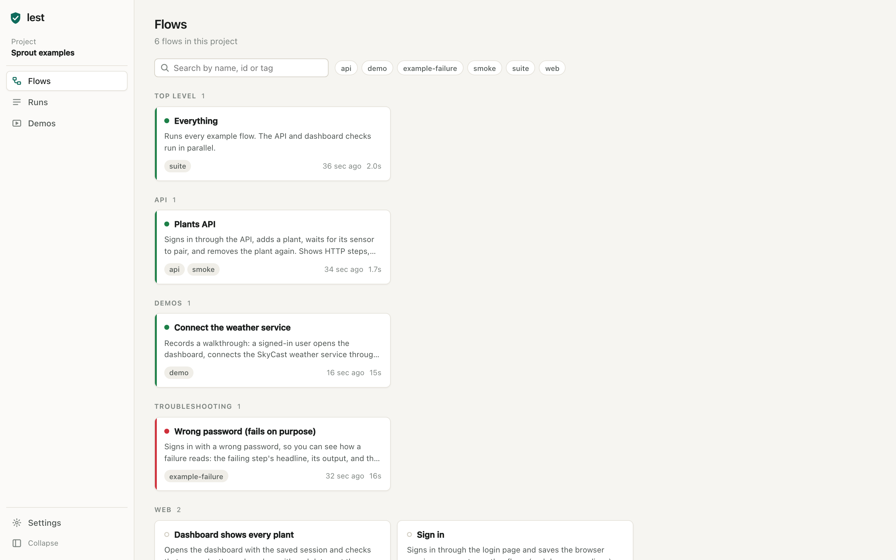
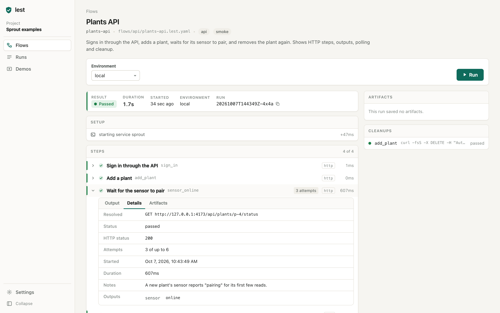
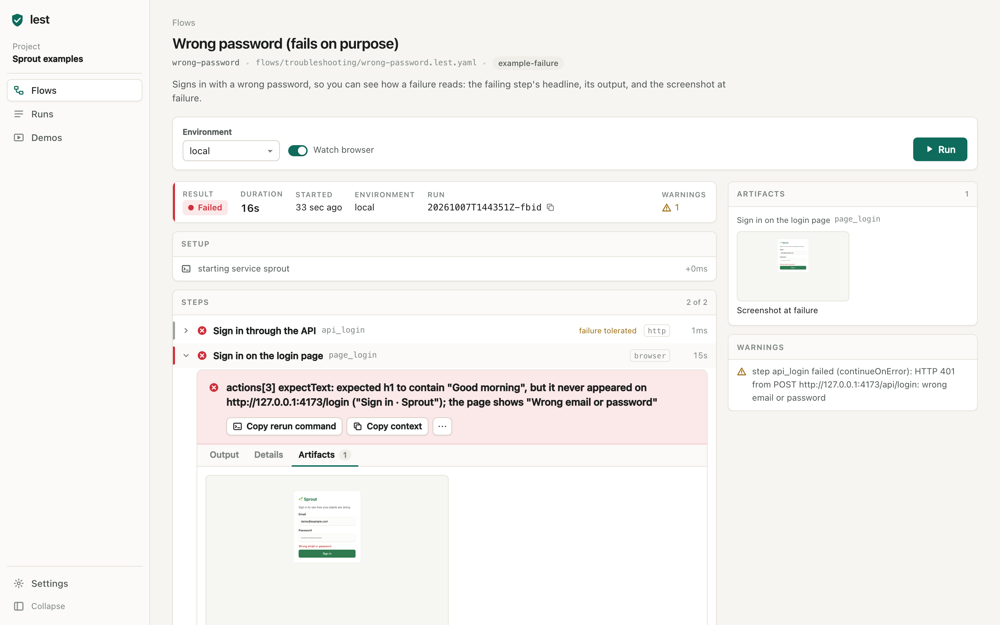
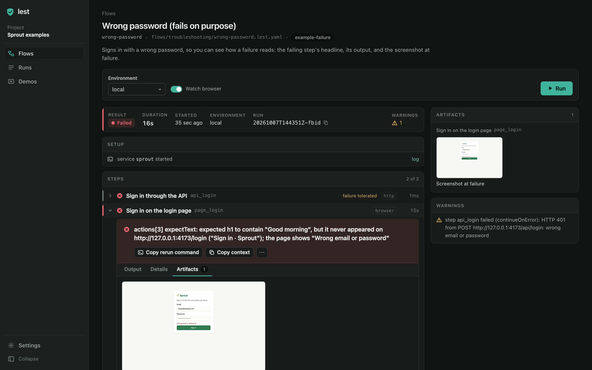
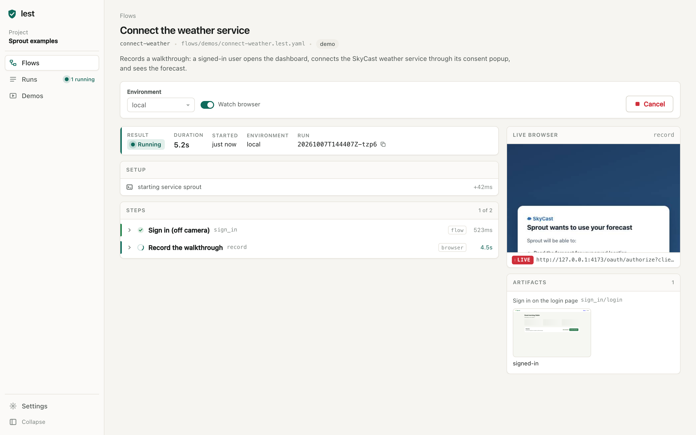
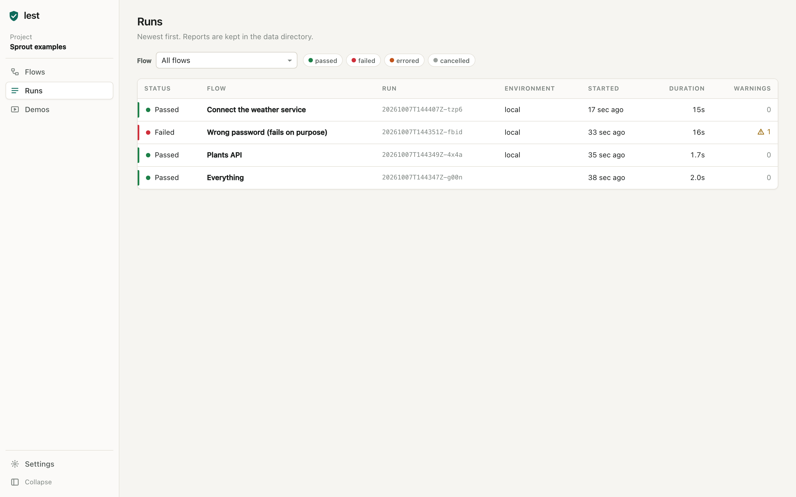
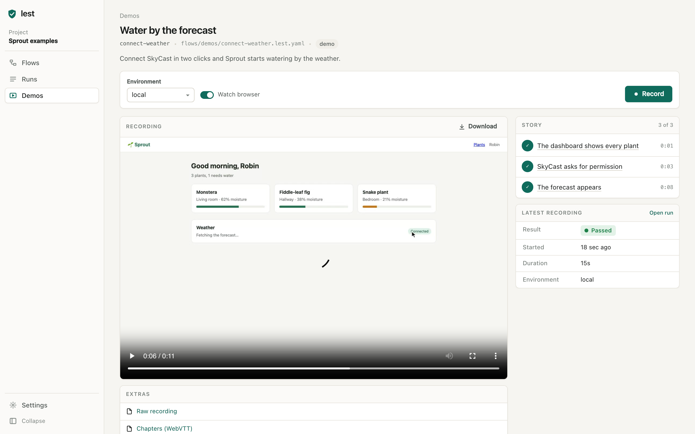
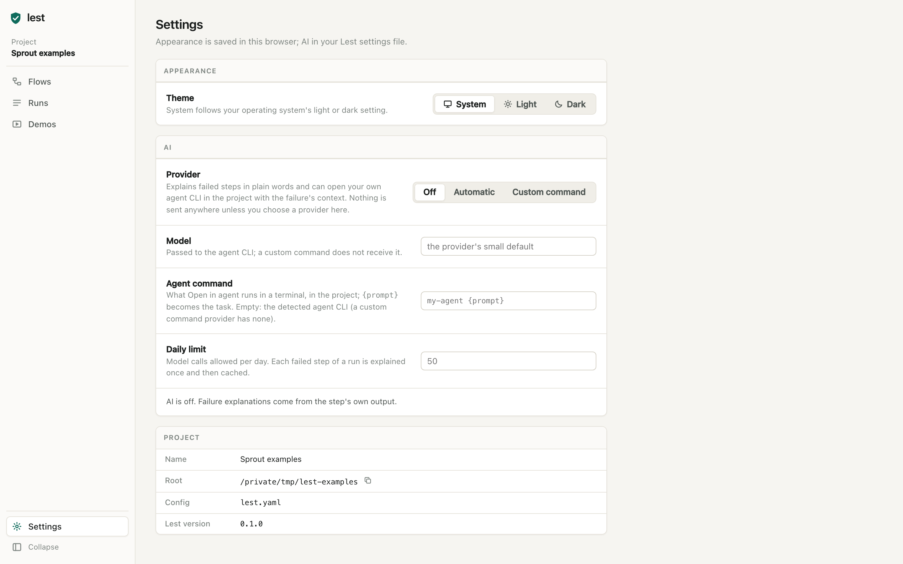
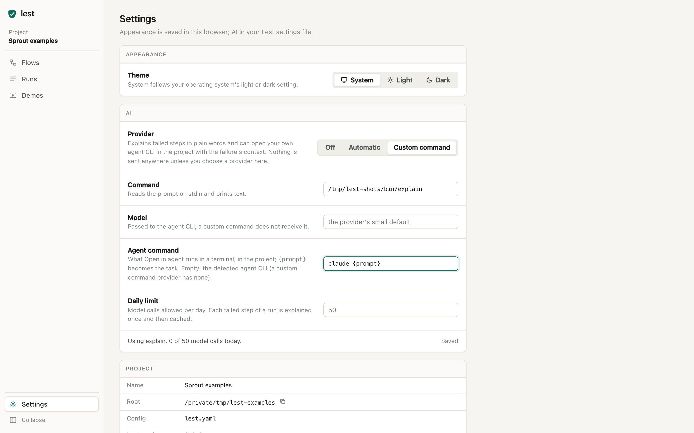
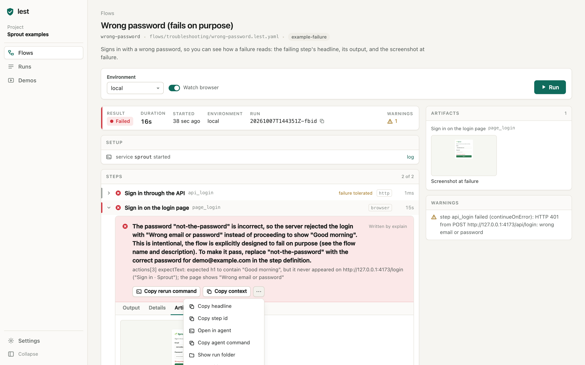

# The UI

`lest ui` serves a web UI on `127.0.0.1` for the current project. It reads the
same flows, runs the same runner and shows the same reports as the CLI. The
source is in `ui/` (see [ui/README.md](../ui/README.md) for development).

`lest ui` opens the address in your default browser; `--no-browser` only
prints it. `lest ui --app` opens it in its own window instead: a
Chromium-family browser (Chrome, Chromium, Edge or Brave) in app mode, with a
profile of its own under the data directory. Without one, it falls back to a
browser tab.

The left rail holds Flows, Runs, Demos and Settings, and shows the project
name. It collapses to icons; the choice is remembered in the browser.

## Flows



Every flow in the project as a card, grouped by folder. A card shows the last
run's result as a dot (hollow when the flow never ran), the first line of the
description, tags, and how long ago the last run started and how long it took.
Search matches names, ids and tags; tag chips filter. Validation problems from
the flow files appear in a banner above the cards, and the affected cards carry
a warning mark.

## A flow



The header shows the flow's name, id, file path, tags and description. Under
it, the run controls: the environment (when the flow defines any), one field
per input (a list for inputs with choices; required inputs are marked), Watch
browser for flows with browser steps, and Run.

While a run is in progress, Run becomes Cancel. The first click stops the
steps; `finally` steps and cleanups still run. Clicking again while cleanup
runs skips the remaining cleanup.

Below the controls is the latest run of the flow: one started from this page,
one in progress on the server, or the newest stored run.

- **Summary:** result, duration (ticking while running), when it started, the
  environment, the run id, and the number of warnings.
- **Setup:** tool preflight results, with a Sign in button when a tool needs an
  interactive sign-in (it opens a terminal running the tool's login command,
  or shows the command to run), and service start messages.
- **Steps:** the step tree. Each row shows a status glyph, name, id, kind and
  duration. A polling step shows its attempt and a countdown to the next one.
  Groups and flow calls expand while they run or fail and collapse when they
  pass; clicking a row overrides that. Expanding a step shows its **Output**
  (live lines while it runs, the report's stdout and stderr after),
  **Details** (what ran, exit code, HTTP status, attempts, outputs, notes) and
  **Artifacts**.
- **Side panel:** the live browser view, the run's artifacts grouped by step
  (images open in a lightbox, videos play in place), cleanups with their
  status, and warnings.

### Failures



A failed step opens with its headline at the top of the step: one
deterministic line built from the error, the exit code and the output, with
the step's `notes` under it. The actions:

- **Copy rerun command:** `lest run <flow> --from <top-level step>`, with the
  run to reuse earlier results from, the environment and the inputs.
- **Copy context:** plain text with the flow file, run, environment, inputs,
  the failed step, what it ran, the headline, exit code or HTTP status,
  attempts, notes, the last 40 lines of stderr and stdout, earlier steps'
  statuses and the rerun command. It is meant to be pasted into an issue, a
  chat or your own coding agent.
- The overflow menu copies the headline or step id, opens the run folder in
  the file manager, or opens the run on its own page.

The headline block is laid out so another text can take its place without
moving anything else on the page (see [AI (optional)](#ai-optional)).

The UI follows the system's light or dark setting, or the choice in Settings:



## Live view



When a browser step starts, the runner reports the page it is driving (its
DevTools port and target id) as a `browserPage` event. The UI opens a WebSocket
straight to that page's DevTools endpoint and sends `Page.startScreencast`.
Chromium then pushes JPEG frames as the page changes. The UI acknowledges each
frame as it arrives, keeps only the newest one and draws it at most about 30
times a second into an image element, so a fast page never queues frames.

When the step opens a popup, the runner reports the popup as the active page
and the view switches to it; when the popup closes, it switches back. The view
shows the page's address and a LIVE badge; IDLE means the page has not changed
for a moment (the screencast sends frames only on change). It stops when the
browser closes or the run ends, and shows "Live view unavailable" if the
connection fails.

The browser accepts DevTools connections only from the UI's own origin
(`--remote-allow-origins`). Turning Watch browser off starts browsers without a
DevTools port, so there is no live view for that run.

## Runs



Every stored run, newest first, with runs in progress at the top. Filter by
flow and result. A row opens the run on its own page (`/runs/<run id>`), which
uses the same run view with Run again in place of the run controls.

## Demos



Flows with a `demo:` block (or the `demo` tag). The gallery card shows the
demo's title, summary and beat labels. A demo's page shows the story as a
numbered list and a Record button, which runs the flow. While it records, the
beats light up as the recording reaches them and the live browser view takes
the main area. Afterwards the page plays the recording: the edited demo video
with chapters when post-production produced one, otherwise the browser step's
raw recording. Popup recordings, the beat sheet and screenshots are listed as
extras. A flow that has not recorded yet says so.

## Settings



Theme (System, Light, Dark), the AI settings, and the project's name, root,
config file and the Lest version. The theme is saved in the browser; the AI
settings are saved in the Lest settings file (`lest config show` prints its
path).

## AI (optional)

AI is off by default, and turning it on or off changes no layout: it fills
places that already hold deterministic content, and its actions live only in
menus.



Settings, AI:

- **Provider:** Off, Automatic (the first agent CLI found on PATH), one
  choice per agent CLI found on PATH, or Custom command. Custom command shows
  a field for the program, which reads the prompt on stdin and prints text.
- **Model:** passed to the agent CLI; a custom command does not receive it.
  Empty means the provider's small default.
- **Agent command:** what Open in agent runs in a terminal; `{prompt}`
  becomes the task. Empty means the detected agent CLI (a custom command
  provider has none).
- **Daily limit:** model calls allowed per day (default 50).
- A status line says whether AI is off, which provider and model are in use
  and how many model calls were made today, or why the choice resolves to
  nothing (for example, no agent CLI on PATH).

Every change is saved right away (text fields after a short pause).



On a failed step of a finished run, with a provider in use, the UI asks the
server to explain the failure once per provider, run and step:

- While it waits, the card shows the deterministic headline and
  "Explaining…" in the marker position at the top right. The run is never
  held up; a run in progress is explained only after it finishes.
- When the model answers, its text takes the headline's place, the marker
  reads "Written by" and the provider's name, and the headline moves to the
  line under it.
- When the model cannot be used (it failed, timed out, or the daily limit is
  reached), the card keeps the headline and adds "AI unavailable:" with the
  reason in small text under it.

Explanations are cached by the server, so reopening a run does not call the
model again.

The step's overflow menu gains two items when there is an agent to open
(an agent command, or a detected agent CLI as the provider), and only while a
provider is in use: **Open in agent** starts your agent CLI in a terminal, in the
project, with a prompt naming the flow, the run and the failed step (if no
terminal can be opened, a dialog shows the error and the command with a Copy
button), and **Copy agent command** copies that command. With AI off, these items are absent and the card is the same
as in [Failures](#failures).

## Updating the screenshots

The images in `docs/images/` come from the real UI:

```bash
cd examples && lest ui --no-browser --port 4790
# in another shell, with the address it printed
cd ui && LEST_UI_URL='http://127.0.0.1:4790/?token=...' npm run screenshots
```

The script starts runs through the API and waits for each state before it
captures. It turns AI off for the regular images and restores the AI settings
afterwards. `flow-failed-ai.png` and `settings-ai.png` need
`LEST_UI_AI_COMMAND` set to a program that reads a prompt on stdin and prints
an explanation; without it they are skipped. Start the server with a PATH that
has no agent CLIs on it so the provider choices in the image are generic. The project root appears in `settings.png`, so run the server from
a copy of `examples/` at a neutral path if your checkout path is personal.
